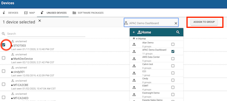
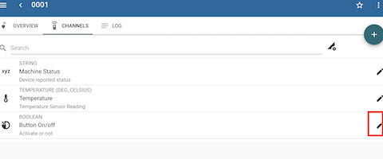
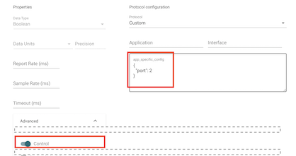
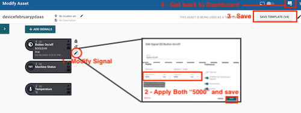
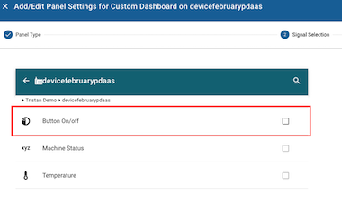
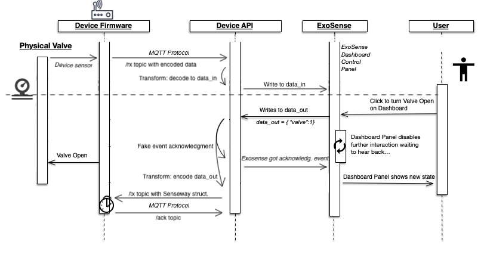
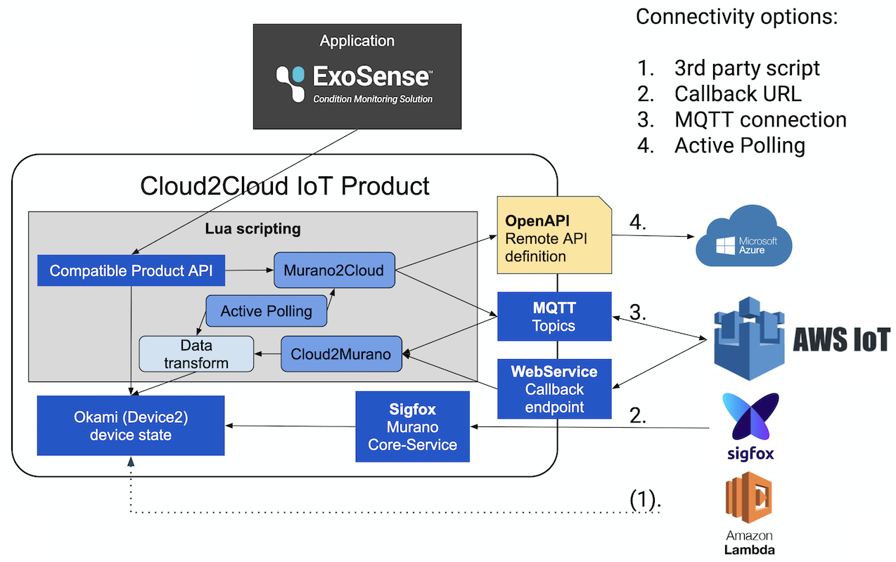

# Murano Cloud-Connector

This project is a template of Murano IoT-Connector for SenseWay LoraWAN integration.

See related documentation on http://docs.exosite.com/connectivity/cloud2cloud/

## Table of Content

- [Using this project](#using-this-project)
- [Start synchronizing devices with MQTT](#start-synchronizing-devices-with-mqtt-client)
- [Types of Integration](#types-of-integration)
- [Customization](#customization)
  - [IoT-Connector integration](#iot-connector-integration)
- [Known limitations](#known-limitations)

---

## Using this project

**This is a project dedicated to SenseWay. Will work using MQTT LoRaWAN**
this cloud integration has its particularity and is not a generic plug&play solution.

This project is build around uses 2 main modules [_c2c.cloud2murano_](./modules/c2c/cloud2murano.lua) to handle incoming data & [_c2c.murano2cloud_](./modules/c2c/murano2cloud.lua) for outgoing. Device state uses the [Device2 Service](http://docs.exosite.com/reference/services/device2) and [_vendor.c2c.transform_](./modules/vendor/c2c/transform.lua). Logic is to map incoming data and provision devices in Murano, with a transformation pipeline.


**Deployment & Auto-update**:
This template disable auto-Deployment by default. However for each integration we suggest to enable the `auto_update` by default in the ./services/config.yaml file.

---
## Start synchronizing devices with MQTT client

This solution enables MQTT Client protocol through a service: _Mqtt_. 

  1. By using this template, in `services` -> `Mqtt`, all credentials from SenseWay must be provided to establish a securised MQTT Client connection, with _user & password_. Refer to [this page](https://www.senseway.net/service/network-service/network-manual/lorawan-mqtt-connection-manual/) for more details.

  1. Topic address will be generated automatically, when you save your service config. Make sure you have entered an username.Good to know, subscribe to your Senseway devices fits this pattern : 
  lora/<*username*>/<*id_of_device*>/rx for uplink information.
  lora/<*username*>/<*id_of_device*>/tx for downlink information.
  It is possible to subscribe to all child node topics with : `#`, or all actual node topics with : `+`

Now, any incoming message will be sent and interpreted in `cloud2murano`. And `vendor/c2c/transform` has a role of parser module, and fits with SenseWay data pattern. They are called Uplink data (with `/rx` topic). They will create a device on the first message, and update it with further incoming data. You can see available devices in `Devices` tab from the App. incoming data is filled first in the `lorawan_meta` resource.


**Synchronize with Exosense**

If you want to start to make operations with exosense, you should start parsing your data (which is a hex in `mod.data` of your message structure). 
  1. change *uplink_by_ports* logic from `vendor/c2c/transform`, adapt your logic depending port values, and how you want to parse your data.
  1. Configure also `vendore/configIO`. You need to create generic *channels* required by Exosense. It is just a global and generalized file and in further (Exosense) you should be able to customize it for each device.

Now you should have a **data_in** resource filled, that will enable you to receive data in Exosense.

This part was easy, now let's move on sending messages to your device. 

In Exosense, any control over a resource (like a trigger On/Off Panel on dashboard on an Asset) will generate a new **data_out** resource will reach then your real device.
For information, Exosense doc page [is here](https://docs.exosite.io/schema/channel-signal_io_schema#device-control-interface-1).

Basically Lorawan device can have different roles, and a specific configIo must be set. On Exosense, it is performed with *channels* from a device, that will update its **config_io** resource. On selected channels, enable control of the device and which port they will use. Follow instructions first: 

  1. In Exosense, make sure to confirm your devices and add them to your group. For this, on `Devices` tab on navigator, choose `Unused devices` and add and **assign to a group** then, like on following screen:
    
  1. Now, on *Device* tab in navigator, select one device. Then in *Channels* menu choose your resource(s) to have control on it.
  

  1. Change two things : in `Advanced`, turn on `Control`and fill `app_specific_config` with :

````
{
  "port": <port value>
}
````
  

  1. Is it time to create an *Asset*. (You'll have then a dedicated *Dashboard* to vizalize and interact on your device through nice UI. It is made of different *panels*, dedicated for a specific thing like metrics, plot, table...). Once you modify your new asset, add your device, that will expose all of its channels (to be used in Dashboard then) In step 2, you added *control* field on your channel. Edit it again in this asset : 
    -Set **Report Rate** and **Timeout** to 5000 ms. This screen picture will help you to create and save it.
  

  1. This resource can be modified in dashbaord, just add a panel. For this, back to `Dashboard` click on "+" on the right and choose `Add a panel`. Choose **ControlPanel**. 
  1. Choose this resource you want to take control on it.
  
  1. You can generate **data_out** with this panel and catch it in Murano !

Now, On Murano side, a new **config_io** resource contains channels, and some of them are designed for downlink. On incoming **data_out** messages, add a strategy to prepare messages to be sent in downlink. In *downlink_by_names* from `vendor/c2c/transform`, specify some logic of encoding data_out depending on your channel type dedicated to your device. It must be in hexa value as [documented here](https://www.senseway.net/service/network-service/network-manual/lorawan-mqtt-connection-manual/). Mqtt messages will be send automatically.

(B) Another way is to simulate a change by sending *data_out* data. For this, You can send JSON, caught in a new declared `Endpoint` from your App. See a detailed documentation about [create an endpoint in Murano App](http://docs.exosite.com/development/quickstart/#1.-first-endpoint).
  - A simple call to `setIdentityState(<your json body>)` from `c2c/murano2cloud` to simulate Exosense control, will change *data_out* resource as well as send Mqtt messages in the `/tx` topic, dedicated for downlink. Make sure your body request, in JSON follows this structure : 
  ````
  {"identity": "<identity_of_your_device>",
    "data_out": 
      "{
        "<Your channel name>": "<A new value in this channel>"
      }"
    }
  }
  ````
 This endpoint is temporary if created from Murano App, and can be lost in further Auto-update from solution.


On this diagram, whole flow is detailed :



**Important** 

  1. You need to know that **data_in** will be provisioned only after de-comment the `transform` module. Also, only after add **configIO** resource to your device (through Exosense), **data_out** can be provisioned, making possible downlink messages.
  1. File `ConfigIO` in `vendor` is not synchronized with Exosense, it must be just a generic pattern, that will be personalized in Exosense for each devices.


**Post Scriptum**

This template uses cache for two values, And if you go under `Settings` and choose `ENV VARIABLES`. Define time in sec. to keep two values in cache valid : add One with followings settings :
**Key** = VMCACHE_TIMEOUT
**Value** = *<Your timeout in sec. ex: 400>*

---

## Types of Integration

The Type of Connectivity for SenseWay is the 3rd. This figure summarizes all the process :




---

### Customization

You can also provide some tooling for the template user to extend your integration.
While you want to be able to provide new version of your template you need to avoid erasing some of the template user changes.
For this purpose we defines a `safeNamespace` for the user (in [murano.yaml](murano.yaml)) every items (modules, endpoints & assets) start with this name will not be remove nor modified by template updates.

User can then safely modify the [modules/vendor/c2c/transform.lua](modules/vendor/c2c/transform.lua) to change the data mapping or even add new public APIs (under `/vendor/*`) to extend the product capability.

If the user don't want to get update, automated updates can be deactivated on the Product `Services -> Config` settings.

_IMPORTANT_: To get persistent product state, related resources needs to be defined in the device2 service resources.
While editor of this template can change the default setup in [services/device2.yaml](services/device2.yaml) (default setup for Exosense compatibility) are needed by the user from the Product page under `Resources` all resources must have the option `sync` set to `false`!

#### IoT-Connector integration

This template can be extended as an IoT Connector (PDaaS) to provide & publish product instance to multiple internal and external applications.

Assuming you have a workable 3rd party cloud integrated and followed the above section.
1. Create a new branch or repo to keep the stand-alone version.
1. Clone the Iot Connector (https://github.com/exosite/pdaas_template) repository.
1. Merge Modules, Assets (`dist/` in folder `app`) & Endpoints: Different namespaces are used and you should be able to copy all modules files into your project modules.
1. Merge Services: some files will overlap, here are rules to follow :
    - config.yaml can be replaced.
    - in device2.yaml, copy only non overlapping `names` in resources and merge manually the rest (`tags_schema`).
1. In murano.yaml, copy from Pdaas file following parts into target :  
    - add non overlapping `safeConfigs` lines.
    - add endpoints definition and assets, and change `location` to target correct folder.
1. Merge init.lua manually.
1. Push your changes to the PDaaS-Cloud2Cloud product branch.
1. Publish the new template to Murano Exchange as described above.

---

### Known limitations


- Exosense `config_io` is fixed (in [modules/vendor/configIO.lua](modules/vendor/configIO.lua)) and cannot be modified per device, except on Exosense.
