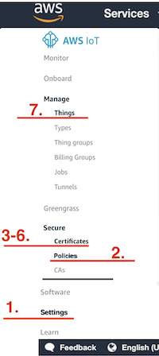

# Murano Cloud-Connector

This project is a template of Murano IoT-Connector for AWS IoT integration.

See related documentation on http://docs.exosite.com/connectivity/cloud2cloud/

## Table of Content

- [Using this project](#using-this-project)
- [Start synchronizing devices with MQTT](#start-synchronizing-devices-with-MQTT)
- [Types of Integration](#types-of-integration)
- [Customization](#customization)
  - [IoT-Connector integration](#iot-connector-integration)
- [Known limitations](#known-limitations)

---

## Using this project

**This is a project dedicated to AWS IoT. Will work using MQTT Client service.**
this cloud integration has its particularity and is not a generic plug&play solution.

This project is build around uses 2 main modules [_c2c.cloud2murano_](./modules/c2c/cloud2murano.lua) to handle incoming data & [_c2c.murano2cloud_](./modules/c2c/murano2cloud.lua) for outgoing. Device state uses the [Device2 Service](http://docs.exosite.com/reference/services/device2) and [_vendor.c2c.transform_](./modules/vendor/c2c/transform.lua). Logic is to map incoming data and provision devices in Murano, with a transformation pipeline.

**Deployment & Auto-update**:
This template disables auto-Deployment by default. However for each integration we suggest enabling `auto_update` by default in the ./services/config.yaml file.

---
## Start synchronizing devices with AWS IoT

This solution enables MQTT protocol through a service : _Mqtt_. 
Set up is important and all steps must be followed carefully. Initially, user should have an AWS account with access on IoT-Core, and should open *AWS IoT dashboard page*. Let's start !
By using this template, start filling some AWS credentials and certificate values. In `service`-> `Mqtt`, which contains blank fields initially. It is explained here :

 
  *AWS Iot Dashboard*
  1. First, in *AWS IoT dashboard* page -> `Settings` check **Endpoint address**. Make sure it is enabled. Back to `service`on Murano, must be copied in `Host` field. Then second field is `8883`. 

  1. In *AWS IoT dashboard page*, click on `Secure` -> `Policies`. Then choose to **Create**. First write a title *AwsPolicy* for ex. and fill these fields:
  \- in `Action` : `iot:*`
  \- in `Resource ARN` : `*`
  Check `Allow` case and `Create`.

  1. First, make sure you have a `Certificate`. Click on `Secure` -> `Certificates`. Choose to **Create**, then **One Click certificate**.

  1. On the window, click first on `Download a root CA AWS IoT`. It will redirect you to new window. **Important don't close the former window**. Here Choose `VeriSign Class 3 Public Primary root CA certificate`. This string key corresponds to `Root CA` field in `sslOptions` from *Mqtt Client* service. Copy and paste string value.

  1. Switch to the previous AWS window, and download `certificate` and also `private key` files . Open them in a *code editor* and copy-paste string value respectively in `certificate pem` , `private key pem` inside `sslOptions` from *Mqtt* service.

  1. Don't forget to click on **activate** on the same window.

  1. *A device is a Thing in AWS IoT*. It is configured in `Manage` -> `Things` from *AWS IoT dashboard page*. If needed create a single one, with fake values.

  1. Still on `Secure` -> `Certificates`, click on *option button* on your new certificate, and `Attach policy`. Attach the policy created.
  Choose also `Attach thing`. Attach things needed to communicate with MQTT.

  1. Provide also a Topic address, to subscribe to AWS IoT devices with this pattern :
  cmd/<*application*>/<*context*>/<*device-id*>/<*res-type*> 
  At any moment, it is possible to subscribe to all child nodes topics with : `#`
  Full details are on [this documentation](https://d1.awsstatic.com/whitepapers/Designing_MQTT_Topics_for_AWS_IoT_Core.pdf), page 13.
  Make sure you add a second address dedicated for downlink messages publishing to AWS IoT. It means AWS IoT must subscribe to this topic too.

Now, any incoming message will be sent and interpreted in `cloud2murano`. And `vendor/c2c/transform` has a role of parser module, and can transform data, to be used in exosense.
When receiving messages, it will initially create devices, and then update with further incoming data. You can see available devices in the `Devices` tab from the App. incoming data is filled first in the `data_in` resource.


**Synchronize with Exosense**

You can then, if needed, synchronize something to AWS IoT. Follow just these steps:

In Exosense, any control over a resource (like a trigger On/Off Panel on dashboard on a device) will generate a new **data_out** resource on Murano side.
For information, Exosense doc page [is here](https://docs.exosite.io/schema/channel-signal_io_schema#device-control-interface-1).
On your ConfigIO, choose which channels enable control of the device. Follow instructions first: 

  1. In Exosense, make sure to confirm your devices and add them to your group. For this, on `Devices` tab on navigator, choose `Unused devices` and add **assign to a group** then, like on following screen:
    
  1. Now, on *Device* tab in navigator, select one device. Then in *Channels* menu choose your resource(s) to have control on it.
    
    in `Advanced`, turn on `Control`.
    

  1. Is it time to create an *Asset*. (You'll have then a dedicated *Dashboard* to visualize and interact on your device through a nice UI. It is made of different *panels*, dedicated to a specific thing like metrics, plot, table...). Once you modify your new asset, add your device, that will expose all of its channels (to be used in Dashboard then) In step 2, you added *control* field on your channel. Edit it again in this asset : 
    -Set **Report Rate** and **Timeout** to 5000 ms. This screen picture will help you to create and save it.
  

  1. This resource can be modified in dashboard, just add a panel. For this, back to `Dashboard` click on "+" on the right and choose `Add a panel`. Choose **ControlPanel**. 
  1. Choose this resource you want to take control of.
  
  1. You can generate **data_out** with this panel and catch it in Murano !

Now, a new **config_io** resource contains channels, and some of them are designed for downlink. In *data_out* from `vendor/c2c/transform`, specify some logic applied on **data_out** to fit with AWS IoT side. Mqtt messages will be sent automatically then.

(B) Another way is to simulate a change by sending *data_out* data. For this, You can send JSON, caught in a new declared `Endpoint` from your App. See a detailed documentation about [create an endpoint in Murano App](http://docs.exosite.com/development/quickstart/#1.-first-endpoint).
  - A simple call to `setIdentityState(<your json body>)` from `c2c/murano2cloud` to simulate Exosense control, will change *data_out* resource as well as send Mqtt messages on topic dedicated for downlink. Make sure your body request, in JSON follows this structure : 
  ````
  {"identity": "<identity_of_your_device>",
    "data_out": 
      "{
        "<Your channel name>": "<A new value in this channel>"
      }"
    }
  }
  ````
 This endpoint is temporary if created from Murano App, and can be lost in further Auto-update from solution.

**Important** 

  1. Only after add **configIO** resource to your device (through Exosense), **data_out** can be provisioned, making possible downlink messages.
  1. File `ConfigIO` in `vendor` is not synchronized with Exosense, it must be just a generic pattern, that will be personalized in Exosense in a second time for each devices.

---

## Types of Integration

The Type of Connectivity for AWS IoT using Mqtt Client service is the 3rd. This figure summarizes all the process :


---

### Customization

You can also provide some tooling for the template user to extend your integration.
While you want to be able to provide new version of your template you need to avoid erasing some of the template user changes.
For this purpose we defines a `safeNamespace` for the user (in [murano.yaml](murano.yaml)) every items (modules, endpoints & assets) start with this name will not be remove nor modified by template updates.

User can then safely modify the [modules/vendor/c2c/transform.lua](modules/vendor/c2c/transform.lua) to change the data mapping or even add new public APIs (under `/vendor/*`) to extend the product capability.

If the user don't want to get update, automated updates can be deactivated on the Product `Services -> Config` settings.

_IMPORTANT_: To get persistent product state, related resources needs to be defined in the device2 service resources.
While editor of this template can change the default setup in [services/device2.yaml](services/device2.yaml) (default setup for Exosense compatibility) are needed by the user from the Product page under `Resources` all resources must have the option `sync` set to `false`!


#### IoT-Connector integration

This template can be extended as an IoT Connector (PDaaS) to provide & publish product instance to multiple internal and external applications.

Assuming you have a workable 3rd party cloud integrated and followed the above `setup` section.
1. Create a new branch or repo to keep the stand-alone version.
1. Clone the Iot Connector (https://github.com/exosite/pdaas_template) repository.
1. Merge Modules, Assets (`dist/` in folder `app`) & Endpoints: Different namespaces are used and you should be able to copy all modules files into your project modules.
1. Merge Services: some files will overlap, here are rules to follow :
    - config.yaml can be replaced.
    - in device2.yaml, copy only non overlapping `names` in resources and merge manually the rest (`tags_schema`).
1. In murano.yaml, copy from Pdaas file following parts into target :  
    - add non overlapping `safeConfigs` lines.
    - add endpoints definition and assets, and change `location` to target correct folder.
1. Merge init.lua manually.
1. Push your changes to the PDaaS-Cloud2Cloud product branch.
1. Publish the new template to Murano Exchange as described above.

---

### Known limitations

- Exosense `config_io` is fixed (in [modules/vendor/configIO.lua](modules/vendor/configIO.lua)) and cannot be modified per device, except on Exosense.
