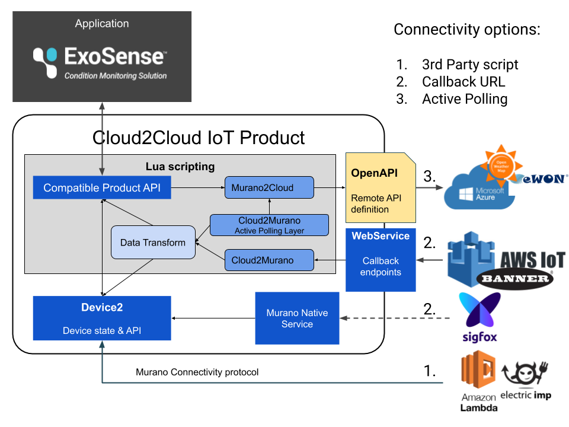

# Murano Cloud-Connector

This project is a template of Murano IoT-Connector for 3rd party components integration.

See related documentation on http://docs.exosite.com/connectivity/cloud2cloud/

## Table of Content

- [Using this project](#using-this-project)
- [Types of Integration](#types-of-integration)
  - [Callback](#callback-integration)
  - [Active Polling](#active-polling-integration)
    - [Lazy Loading](#lazy-loading)
    - [Polling Interval](#polling-interval)
- [Add the 3rd party API as Murano service](#add-the-3rd-party-api-as-murano-service)
  - [Define the OpenApi Swagger](#define-the-openapi-swagger)
  - [Publish it on the Exchange Marketplace](#publish-it-on-the-exchange-marketplace)
- [Update the Template project](#update-the-template-project)
  - [Publish the Cloud integration template](#publish-the-cloud-integration-template)
- [Customization](#customization)
  - [Setup for ExoSense](#setup-for-exoSense)
  - [IoT-Connector integration](#iot-connector-integration)
- [Known limitations](#known-limitations)

---

## Using this project

**Each integration should use a dedicated repository or branch.**
As each cloud integration has its particularity, this project requires modification to fit the 3rd party setup and is not a generic plug&play solution.

This project is build around uses 2 mains modules [_c2c.cloud2murano_](./modules/c2c/cloud2murano.lua) to handle incoming data & [_c2c.murano2cloud_](./modules/c2c/murano2cloud.lua) for outgoing. Device state uses the [Device2 Service](http://docs.exosite.com/reference/services/device2) and [_c2c.device2_](./modules/c2c/device2.lua) to map function requiring remote access.

You will also find a generic data transformation pipeline with the [_vendor.c2c.transform_](./modules/vendor/c2c/transform.lua) module.

**Deployment & Auto-update**:
This template disable auto-Deployment by default. However for each integration we suggest to enable the `auto_update` by default in the ./services/config.yaml file.

---

## Types of Integration

The starting point is to identify what type of integration you want to establish.



1. This type of integration is done in the 3rd party logic accessing [Murano device API](http://docs.exosite.com/connectivity/device-api/) and standard IoT-Connector can be used (no need of this project)
1. **Callback integration**, where the remote component emit a fixed Http request forcing the connector API to be customized (based on this project).
1. For **Active Polling integration** the Murano Connector is in charge of calling the remote API.

This page covers cases 2 & 3 which can in some cases be combined.

---

### Callback Integration

The remote component is actively sending data using HTTP requests, so the use of a [Webservice endpoint](http://docs.exosite.com/development/scripting/#api-endpoint-scripts) to handle the callback is required.

A default [`POST /c2c/callback` endpoint](./endpoints/c2c/callbacks.lua) is defined in  ./endpoints/c2c/callbacks.lua which defer to following modules:
- [_c2c.authentication](./modules/c2c/authentication.lua) for authenticating the 3rd party. Customize this file to match how the 3rd party callbacks request can be authenticated.
- [_c2c.cloud2murano_](./modules/c2c/cloud2murano.lua) for handling the payload content and matching the 3rd party data structure to the one expected from Murano (or Exosense). Modify the `sync` & `data_in` functions accordingly.

By default the [_c2c.cloud2murano_](./modules/c2c/cloud2murano.lua) will automatically create a new device base on incoming data so user don't need to provision devices on Murano.

If enabled by the 3rd party API you can also automate the callback creation for the user when user setup his 3rd party API credentials in the [Config service `service` event handler](./services/config_service.lua). Note this requires to [define the remote API as Murano OpenApi Service](#add-the-3rd-party-api-as-murano-service).

See [Update the Template project](#update-the-template-project) for more details.

**Test It**

First create a Cloud-Connector from this template. You can find it already published under [`Cloud2Cloud Example` element](https://www.exosite.io/exchange/catalog/component/5dde315d12321206a30244d4).

Then get on the newly created page and copy the domain from the top left `|www|` icon.

Replace the domain in below command and use it to trigger the callback.

```
curl -d '{"identity":"sn1", "temperature":42}' -H "Content-Type: application/json" -X POST https://<connector domain>/c2c/callback
```

Or batch with

```
curl -d '[{"identity":"sn1", "temperature":42},{"identity":"sn2", "temperature":43}]' -H "Content-Type: application/json" -X POST https://<connector domain>/c2c/callback
```

---

### Active Polling Integration

In case remote component do not provide active callbacks, you can integrate an active fetching logic in this project.
For this purpose you must [define the remote API as Murano OpenApi Service](#add-the-3rd-party-api-as-murano-service).

Fetching device data can be done in 2 ways:

##### Lazy Loading

Wait for the application(s) to fetch device data when calling the Connector `getIdentityState()`, `getIdentity()` or `listIdentities()` operations.

Those operations should be defined as function (and, if needed, customized) in the [_c2c.murano2cloud_ module](./modules/c2c/murano2cloud.lua).

The related operation needs to be defined in the 3rd party API service openAPI file. (./DummyCloudService.yaml) for fetching remote device state.
In this default product we only define a `getIdentityState` api to fetch device state one by one.

**Test It**

First you need an application connected to the Connector with a way to fetch devices.
If the application doesn't provide any interface you can define below [Webservice endpoint](http://docs.exosite.com/development/quickstart/).

_GET /devices_
```
return <Connector name>.listIdentities()
```

The test `Dummycloudservice` from this project then relay the synchronization requests to https://requestbin.com/r/enawzlihjdvb7 and you should see the incoming request. A real 3rd party service would return the list of devices accordingly.

##### Polling Interval

Actively fetch for device update on a timely base. (Eg. every hour).
This can be done using the [Timer Service](http://docs.exosite.com/reference/services/timer) and the frequency needs to be defined in the ./services/timer.yaml configuration file.

The default logic set in the [services/timer_timer.lua](services/timer_timer.lua) eventhandler will use the same structure as for callbacks.

See [Update the Template project](#update-the-template-project) for more details.

**Test It**

This project already defines the [`GET /c2c/callback` endpoint](./endpoints/c2c/callbacks.lua) to trigger an update.

First create a Cloud-Connector from this template. You can find it already published under [`Cloud2Cloud Example` element](https://www.exosite.io/exchange/catalog/component/5dde315d12321206a30244d4).

Then get on the newly created page and copy the domain from the top left `|www|` icon.
Replace the domain in below command and use it to trigger the callback.

```
curl https://<connector domain>/c2c/callback
```

The test `Dummycloudservice` from this project then relay the synchronization requests to https://requestbin.com/r/enawzlihjdvb7 and you should see the incoming request. A real 3rd party service would return the list of devices accordingly.

---

### Add the 3rd party API as Murano service

This project includes the `Dummycloudservice` targeting http://requestbin.com already published to Murano Exchange Marketplace.
However in a real scenario you will need to define the 3rd party API to support the [Active Polling Integration](#active-polling-integration).

This section is to enable Murano to connect to an interact with the 3rd party cloud.
If you intend to only support incoming callbacks, you can ignore this section.

Once the below steps are ready, add a new configuration file to replace ./services/dummycloudservice.yaml maching the name of the service published on Exchange.

**Important** Service naming is all lower case with no special character. From scripting the first letter is capitalized.

##### Define the OpenApi Swagger

First you need to define the 3rd party service API using the OpenApi swagger definition.
You can follow the general documentation from https://github.com/exosite/open_api_integration.
But also follow the guidelines from the example available on this project in ./DummyCloudService.yaml .

For example this sample assumes the use of a `token` parameter for authentication to the 3rd party.

##### Publish it on the Exchange Marketplace

Publish the service swagger on Murano Exchange IoT marketplace (http://docs.exosite.com/reference/ui/exchange/authoring-elements-guide/#openapi-integration-service) and test your integration with a blank Murano solution.

Once ready publish the service as 'Public' so it can be used. (This action is currently limited so you might need to contact Exosite support).

---

### Update the Template project

This project now need to be adapted for the 3rd party connectivity needs. See the [Types of Integration](#types-of-integration) chapter if you haven't yet.

Before getting started: to be compatible with IoT connector (PDaaS) for a later integration follow:
- Use the `c2c` namespacing for Modules, Endpoints, Assets and any stored items to avoid potential naming conflict
- Avoid adding code in eventhandlers as it will make the merging harder, instead put your code in Modules
- Make clear commits so you can easily rebase on future updated version of this base template

**1. Clone this repository**

**2. Update this project with the newly created service**

In [`c2c.cloud2murano` module](./modules/c2c/cloud2murano.lua) update `Dummycloudservice` by the actual service alias you used to publish the service on Murano IoT marketplace.
Important in Lua, service starts with a Capital letter.

If not done yet create a configuration file under [./service/dummycloudservice.yaml](./service/dummycloudservice.yaml) containing the service fixed settings. If all configuration need to be provided by the users, leave the file blank.

**3. Modify the callback authentication logic**

This sample assumes a single callback endpoint for each event defined in [endpoints/c2c/callbacks.lua](endpoints/c2c/callbacks.lua) & [modules/c2c/authentication.lua](modules/c2c/authentication.lua).
We use a token generated at solution bootstrap & passed as query parameter to authenticate the 3rd party.
Other authentication system can be defined there.

**4. Modify the data structure mapping logic**

2 modules are used for data mapping with the 3rd service.

[modules/c2c/cloud2murano.lua](modules/c2c/cloud2murano.lua) for incoming messages.
This files parse & dispatches the data coming from the 3rd party to Murano device state service and to the applications.
You need to modify this file to match the 3rd party events for device provisioning, deletion and incoming sensor data.

[modules/c2c/murano2cloud.lua](modules/c2c/murano2cloud.lua) for outgoing messages.
The payload structure needed in this files depends on the the swagger definition of the service.

**[5. Modify pooling logic] (Optional)**

If the 3rd party requires a regular pooling syncronisation, you need to enable the internal in the ./services/timer.yaml config.
The default logic set in the [services/timer_timer.lua](services/timer_timer.lua) eventhandler will use the same structure as for callbacks.

#### Publish the Cloud integration template

Once the project setup is ready and updated on your repository.
You can test it by creating a new product `From scratch` on the Murano solution page and provide your git repo url.

Find more about Murano template on https://github.com/exosite/getting-started-solution-template.

Once satisfied you will need to publish a Template element on Murano IoT marketplace (http://docs.exosite.com/reference/ui/exchange/authoring-elements-guide/).

**Consumer flow: how to use the template in murano**
1. User go to Murano IoT marketplace select your integration template & click create solution.
1. User go to the newly created product management page under `Services -> <dummycloudservice>` and add the required settings & credentials as defined by your 3rd party service Swagger.
1. (Optional) If callback setup is not automated, user copy/past the callback url from there and add it to the 3rd party setup.
1. The product is then ready to use and can be added to any Murano applications as a regular product.

---

### Customization

You can also provide some tooling for the template user to extend your integration.
While you want to be able to provide new version of your template you need to avoid erasing some of the template user changes.
For this purpose we defines a `safeNamespace` for the user (in [murano.yaml](murano.yaml)) every items (modules, endpoints & assets) start with this name will not be remove nor modified by template updates.

User can then safely modify the [modules/vendor/c2c/transform.lua](modules/vendor/c2c/transform.lua) to change the data mapping or even add new public APIs (under `/vendor/*`) to extend the product capability.

If the user don't want to get update, automated updates can be deactivated on the Product `Services -> Config` settings.

_IMPORTANT_: To get persistent product state, related resources needs to be defined in the device2 service resources.
While editor of this template can change the default setup in [services/device2.yaml](services/device2.yaml) (default setup for Exosense compatibility) are needed by the user from the Product page under `Resources` all resources must have the option `sync` set to `false`!

#### Setup for ExoSense

ExoSense application datamodel nest device data into the 'data_in' product resource of type JSON.
In order to be utilized from ExoSense, the 'data_in' content structure, named channels, have to be described in the 'config_io' resource.

The device2 data structure set in [services/device2.yaml](services/device2.yaml) is already ExoSense compatible.
However template user needs to update the product [modules/vendor/configIO.lua](modules/vendor/configIO.lua) Module and updates the data structure specific to the product.

#### IoT-Connector integration

This template can be extended as an IoT Connector (PDaaS) to provide & publish product instance to multiple internal and external applications.

Assuming you have a workable 3rd party cloud integrated and followed the above `setup` section.
1. Create a new branch or repo to keep the stand-alone version.
1. Clone the Iot Connector (https://github.com/exosite/pdaas_template) repository.
1. Merge Modules, Assets (`dist/` in folder `app`) & Endpoints: Different namespaces are used and you should be able to copy all modules files into your project modules.
1. Merge Services: some files will overlap, here are rules to follow :
    - config.yaml can be replaced.
    - in device2.yaml, copy only non overlapping `names` in resources and merge manually the rest (`tags_schema`).
1. In murano.yaml, copy from Pdaas file following parts into target :  
    - add non overlapping `safeConfigs` lines.
    - add endpoints definition and assets, and change `location` to target correct folder.
1. Merge init.lua manually.
1. Push your changes to the PDaaS-Cloud2Cloud product branch.
1. Publish the new template to Murano Exchange as described above.

---

### Known limitations

- As external service don't have an event API, current version requires the webservice to add custom routes for callback. (MUR-9171)
- If the 3rd party api requires signature header, the signature management needs to be done in Lua.
- Device2 service doesn't support batch functionality yet.
- Exosense `config_io` is fixed (in [modules/vendor/configIO.lua](modules/vendor/configIO.lua)) and cannot be modified per device.
